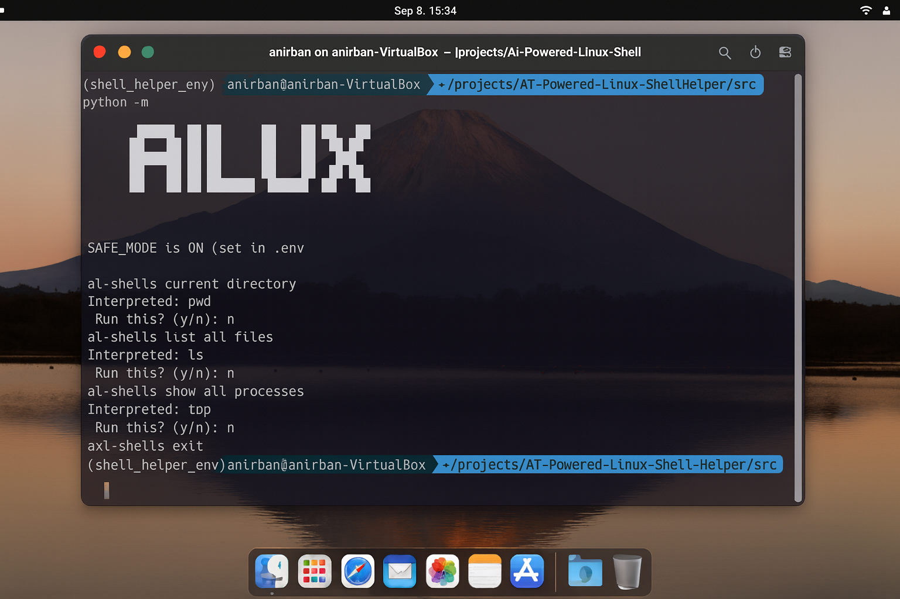

# 🚀 AILUX – AI Powered Linux Shell Helper


[](LICENSE)


AILUX (AI Linux User eXperience) is an **AI-powered shell assistant** that transforms natural language into safe shell commands.  
It makes the command line more **intuitive**, **educational**, and **secure**.

---

## ✨ Why AILUX?

- 🔎 **Understandable** – Write queries like *“show my current directory”* and get `pwd`.  
- 🛡 **Safe Mode** – Commands run only with your approval.  
- ⚡ **Efficient** – Backed by embeddings + FAISS index for fast semantic matching.  
- 🔧 **Extensible** – Add new commands, phrases, or even plugins.  
- 🎓 **Educational** – Learn Linux commands as you use them.

---

## 📸 Demo

```bash
ai-shell$ current directory
Interpreted: pwd
Run this? (y/n): y

ai-shell$ list all files
Interpreted: ls .
Run this? (y/n): y
```




🛠️ Installation

Clone repo
```bash
git clone https://github.com/your-username/AI-Powered-Linux-Shell-Helper.git
cd AI-Powered-Linux-Shell-Helper
```

Create virtual environment
```bash
conda create -n shell_helper_env python=3.10 -y
conda activate shell_helper_env
```

Install dependencies
```bash
pip install -r requirements.txt
```

Build FAISS index
```bash
python -m src.preprocess_embeddings
```

Run AILUX
```bash
python -m main
```

🤝 Contributing

Contributions, issues, and feature requests are welcome!
Just fork the repo and submit a PR.

📄 License

Distributed under the MIT License.
See 
 for details.